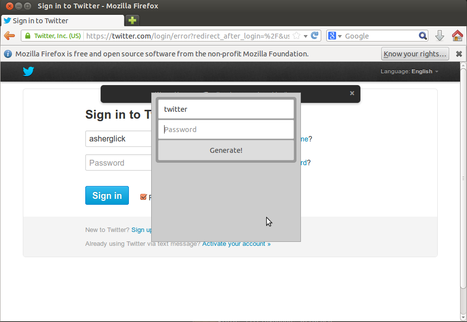

You can install the Firefox Extension 
[here](https://addons.mozilla.org/en-US/firefox/addon/passcodes)

Screenshot
----------

Development
-----------

Before you begin testing or developing the Firefox extension you will need the Firefox Add-on SDK. Instructions for how to download and install the SDK for various operating systmes can be found on [Mozilla's Website](https://developer.mozilla.org/en-US/Add-ons/SDK/Tutorials/Installation) 

To test and run the source of the Firefox extension, enter the directory Passcodes/source/FirefoxExtension

	cd Passcodes/source/FirefoxExtention
    cfx run

A useful command when trying to get console output from just the passcodes plugin is

    cfx run 2>&1 | grep passcodes

